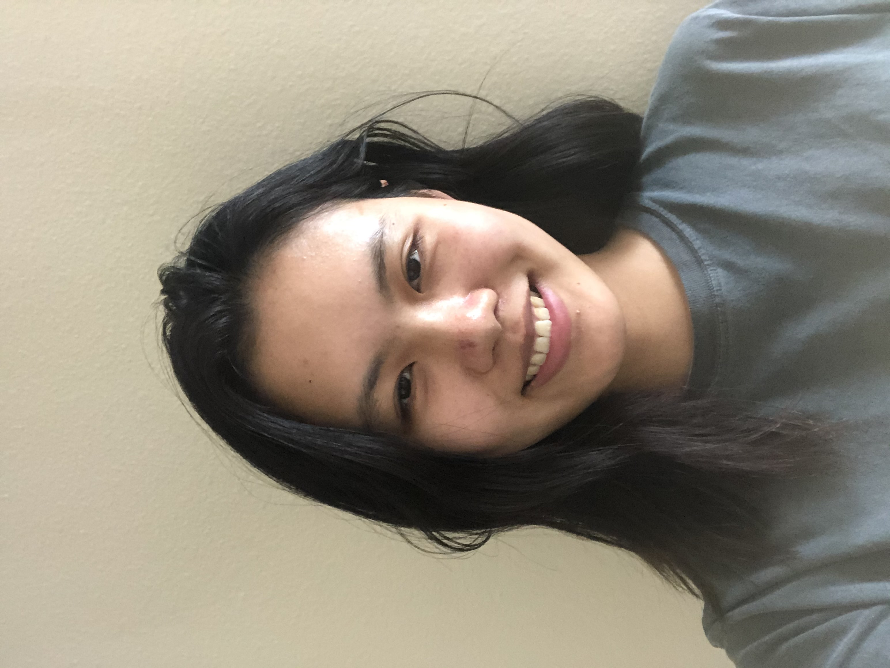

# **Xiaoye Zuo**'s ~~Lab1~~ User Page
## Hello there! My name's **晓晔** and I'm a senior major in computer engineering with a minor in business. I'm from Chongqing, China. When I'm not coding(which is most of the time), I'm probably reading, hiking, cooking, or wandering around random streets. 

### Feel free to check out my [LinkedIn page](https://www.linkedin.com/in/xiaoye-zuo-532106186/):  

### &nbsp;&nbsp;  Random things about me:
- My favorite drink is water
- I find peace in reading the Walden - [quote of the day](https://github.com/LavitaZ/cse110/blob/new-branch/index.md#--fun-fact)
- I love haunted house, but only when I'm sandwiched

### &nbsp;&nbsp;  My preferred programming languages:
1. Python: easy syntax + abundant libraries
2. C/C++: fast execution + wide application
3. MATLAB: easy visualization

### &nbsp;&nbsp; What I hope to get out of CSE110:
- [ ] Familiarity with software development process
- [ ] More advanced coding skills
- [ ] Have fun and meet new friends
   
### &nbsp;&nbsp;  Fun fact 
` git ` is a curse word in British slang

### &nbsp;&nbsp; Quote of the day:
> The mass of men lead lives of quiet desperation. -Henry David Thoreau

[README](./README.md)